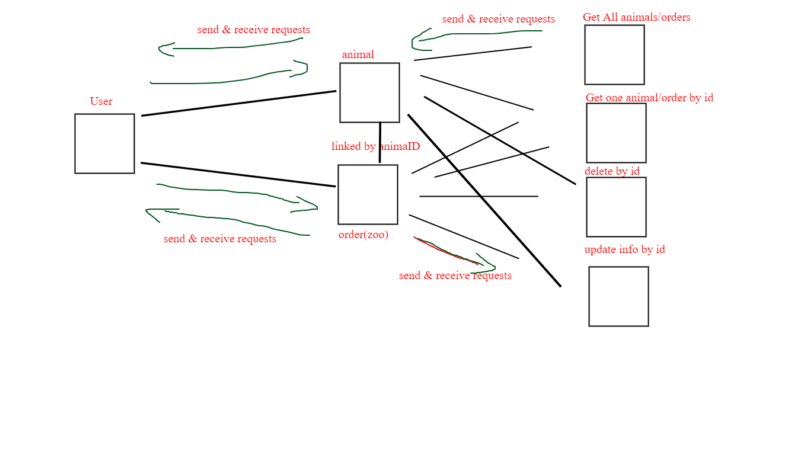

PULL REQUEST: https://github.com/yazanbaker94/api-server/pull/1

DEPLOYED VERSION ON HEROKU: https://api-server-yazan.herokuapp.com/

How do I install the app or library?

Clone repo on your local machine
Open terminal, run npm i
Run your postgress server
Create a database called 'yazanbakertwo'
Create an .env file and add your PORT='PORTNUMBER' to run the server on
Run ThunderBird, add a POST request localhost:PORT/animal with animal name and send the POST request. 

After that, go /animal and you can see the data.

/order is connected to /animal tables by "animalId", therefore you can create an order only with the IDS from the animal table.

you can get the data by making a get request in /order
How do I test the app or library? Run localhost:PORT/people on your localhost to see it working with no errors.

You can add, delete, get, getOne, update.
